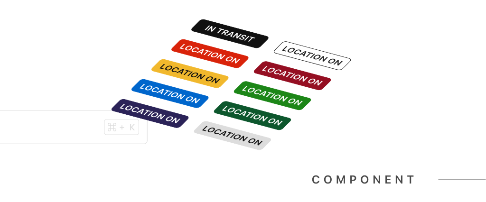
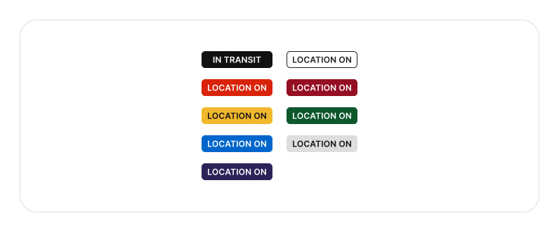
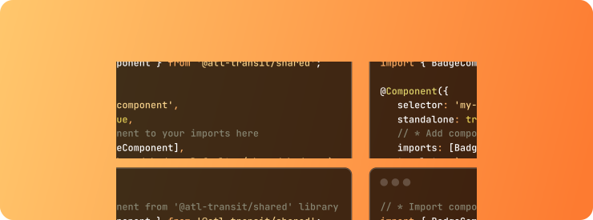

# Overview

The badge component is a small UI element used to display information or status. It is commonly used to highlight important or relevant information to the user. Badges can be customized with different colors and shapes.

## Appearance



### White
```html
<shared-badge> White is the default color </shared-badge>
<shared-badge [color]="'white'"> White </shared-badge>
```

### Black
```html
<shared-badge [color]="'black'"> Black </shared-badge>
```

### Red
```html
<shared-badge [color]="'red'"> Red </shared-badge>
```

### Orange
```html
<shared-badge [color]="'orange'"> Orange </shared-badge>
```

### Gold
```html
<shared-badge [color]="'gold'"> Gold </shared-badge>
```

### Green
```html
<shared-badge [color]="'gold'"> Green </shared-badge>
```

### Blue
```html
<shared-badge [color]="'blue'"> Blue </shared-badge>
```

### Gray
```html
<shared-badge [color]="'gray'"> Gray </shared-badge>
```

## Shapes

### Pill Badge


```html
<shared-badge [radius]="'radius'"> Pill </shared-badge>
```

### Icon Badge

```html
<shared-badge [radius]="'icon-pill'"> G </shared-badge>
```


## Types & Interfaces



### Badge Color Type

```typescript
export type BadgeColor =
  | "gold"
  | "red"
  | "orange"
  | "green"
  | "blue"
  | "gray"
  | "white"
  | "black";
```

### Badge Radius

```typescript
export type BadgeRadius = "default" | "pill" | "icon";
```


## How to Import Component

```typescript
// * Import component from '@atl-transit/shared' library
import { BadgeComponent } from "@atl-transit/shared";

@Component({
  selector: "my-component",
  standalone: true,
  // * Add component to your imports here
  imports: [BadgeComponent],
  template: ` <shared-badge> Default </shared-badge> `,
})
export class MyComponent {}
```