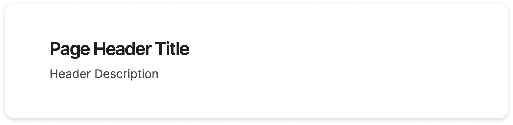
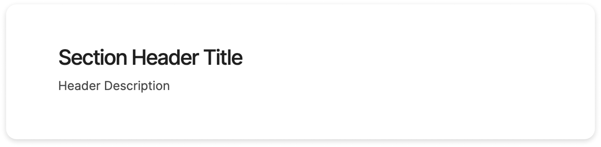
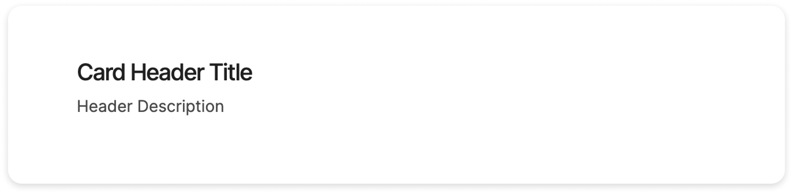

import { Steps } from '@astrojs/starlight/components';


The `HeaderComponent` is a versatile component used to display a title and a description in your application. It's highly customizable, allowing you to adjust its appearance based on the context it's used in.

## Appearances

The `HeaderComponent` can take on three different appearances, or "variants": `page`, `section`, and `card`. The variant determines the styling of the header.

- `page`: This is the default variant. It's suitable for page titles.
- `section`: This variant is ideal for section titles within a page.
- `card`: Use this variant for titles within a card.

---

### Page Header



```html
<shared-header
 [content]="{ title: 'Page Header Title', description: 'Header Description' }"
 variant="page" />
```

### Section Header




```html
<shared-header 
[content]="{ title: 'Section Header Title', description: 'Header Description' }"
variant="section" />
```

### Card Header




```html
<shared-header
[content]="{ title: 'Card Header Title', description: 'Header Description' }"
variant="card" />
```

---

## Props 

The `HeaderComponent` accepts the following props:

```ts
   /**
    * `content` is an object that represents the content of the header.
    * This property is decorated with `@Input()`, which means it's a property that can be set by a parent component.
    */
   @Input() content!: Header;

   /**
    * `variant` is a string that represents the variant of the header.
    * It can be 'page', 'section', or 'card'.
    * This property is decorated with `@Input()`, which means it's a property that can be set by a parent component.
    * If not provided, it defaults to 'page'.
    */
   @Input() variant: 'page' | 'section' | 'card' = 'page';
```

## How to Import It


<Steps>

1. Import the component into your MDX file:

   ```ts
   import { HeaderComponent } from "@atl-transit/shared";
   ```

2. Add your component into the import property of your component
    
   ```ts
   @Component({
     selector: "my-component",
     standalone: true,
     imports: [HeaderComponent],
   })
   export class MyComponent {}
   ```

</Steps>

