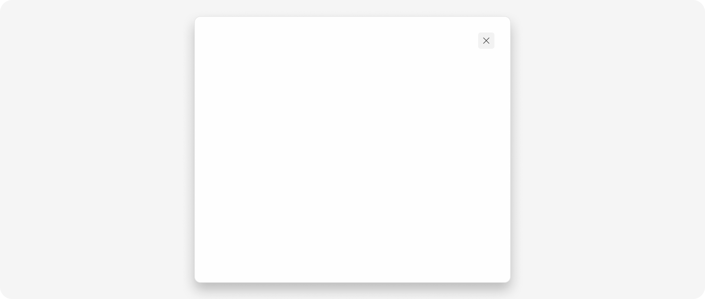
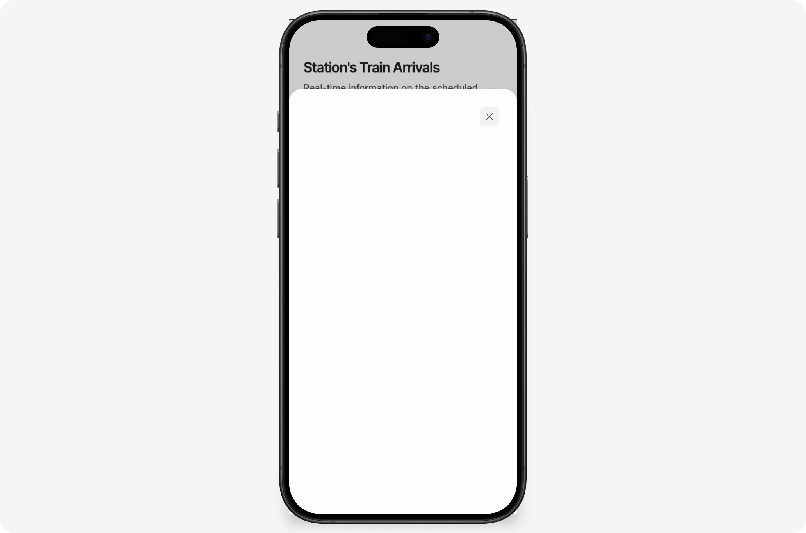

import { Steps } from '@astrojs/starlight/components';


The `ModalComponent` is a versatile component used to display overlay content in your application. It's highly customizable, allowing you to adjust its appearance based on the context it's used in.

## Appearances

The `ModalComponent` can take on two different appearances, or "variants": a regular modal or a bottom sheet. The variant determines the styling of the modal.

- Regular modal: This is the default variant. It's suitable for most use cases.
- Bottom sheet: This variant is ideal for mobile-friendly interfaces.

---

### Regular Modal



```html
<shared-modal
 [isOpen]="true"
 [isBottomSheet]="true" />
 ```

 ### Bottom Sheet Modal


```html
<shared-modal
 [isOpen]="true"
 [isBottomSheet]="false" />
 ```


## Props 

The `ModalComponent` accepts the following props:

```ts
   /**
    * The `isOpen` property determines the current state of the modal.
    * It can be used by a parent component to set the initial state of the modal.
    * It is an @Input property, meaning it can be bound to a property of a parent component.
    */
   @Input() isOpen = false;

   /**
    * The `isBottomSheet` property determines if the modal is a bottom sheet.
    * It can be used by a parent component to set the modal as a bottom sheet.
    */
   @Input() isBottomSheet = true; // New input property

   /**
    * The `modalChange` event is emitted whenever the modal is closed.
    * It emits a boolean value representing the new state of the modal.
    * It is an @Output property, meaning a parent component can listen for this event.
    */
   @Output() modalChange = new EventEmitter<boolean>();

   /**
    * The `closeModal` method is called to close the modal.
    * It emits the `modalChange` event with a value of `false` and sets `isOpen` to `false`.
    */
   closeModal() {
      this.modalChange.emit(false);
      this.isOpen = false;
   }
```

## How to Import It


<Steps>

1. Import the component into your MDX file:

   ```ts
   import { ModalComponent } from "@atl-transit/shared";
   ```

2. Add your component into the import property of your component
    
   ```ts
   @Component({
     selector: "my-component",
     standalone: true,
     imports: [ModalComponent],
   })
   export class MyComponent {}
   ```

3. In your `component.ts` file, set the `isOpen` property to `true` to open the modal:

   ```ts
   export class MyComponent {
      openModal = true;

      onModalChange(isOpen: boolean) {
         this.openModal = isOpen;
      }
   }
   ```
   

4. Use the component in your template:

   ```html
     <shared-modal
    [isOpen]="openModal"
    [isBottomSheet]="false"
    (modalChange)="onModalChange($event)"
    class="scrollbar-hide"
    >
        <div class="text-center">
            <h2 class="text-6 font-semibold mb-4">My Modal</h2>
            <p class="text-4 font-medium text-neutral02">
                You have successfully created a modal component using the shared library.
            </p>
        </div>
     </shared-modal>
   ```

5. Now add a button to open the modal:

   ```html
    <button class="btn btn-primary" (click)="openModal = true">
        Open Modal
    </button>
    ```

</Steps>
