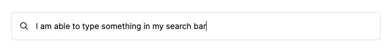

import { Steps } from '@astrojs/starlight/components';


The `SearchBarComponent` is a component used to implement a search feature in your page. 
It's highly customizable, allowing you to adjust its appearance and functionality based on the context it's used in.

## Features

The `SearchBarComponent` can take on two different states: interactive or non-interactive. The state determines the functionality of the search bar.

- Interactive: This is the default state. The search bar collects user input and emits it for the parent component to handle.
- Non-interactive: In this state, the search bar is not functional and only serves as a clickable element, typically used to open a search modal.

---


 ### Non-interactive Search Bar


```html
<shared-search-bar
  [placeholder]="'Try Searching Doraville Station'" />
 ```

### Interactive Search Bar



```html
<shared-search-bar
 [interactive]="true"
 [placeholder]="'Try Searching Doraville Station'" />
 ```


## Props 

The `SearchBarComponent` accepts the following props:

```ts
   /**
    * The `placeholder` property sets the placeholder text for the search bar.
    */
   @Input() placeholder!: string;

   /**
    * The `interactive` property determines whether the search bar is functional or not.
    */
   @Input() interactive = false;

   /**
    * The `queryEmitter` event is emitted whenever a search is performed.
    * It emits a string value representing the search query.
    */
   @Output() queryEmitter = new EventEmitter<string>();
```

## How to Import It

<Steps>

1. Import the component into your TypeScript file:

   ```ts
   import { SearchBarComponent } from "@atl-transit/shared";
   ```

2. Add your component into the import property of your component
    
   ```ts
   @Component({
     selector: "my-component",
     standalone: true,
     imports: [SearchBarComponent],
   })
   export class MyComponent {}
   ```

3. In your `component.ts` file, create a method to collect the value emitted from the search bar:

   ```ts
   export class MyComponent {
      searchValue: string = '';

      onSearch(query: string) {
         this.searchValue = query;
         // Now you can use this.searchValue in your component
      }
   }
   ```
   

4. Use the component in your template:

   ```html
     <shared-search-bar
    [interactive]="true"
    [placeholder]="'Search for products...'"
    (queryEmitter)="onSearch($event)"
    class="search-bar"
    >
     </shared-search-bar>
   ```

5. Then, in your template, bind the `queryEmitter` output event to this method:

   ```html
   <shared-search-bar
      [interactive]="true"
      [placeholder]="'Search for products...'"
      (queryEmitter)="onSearch($event)"
      class="search-bar"
   >
   </shared-search-bar>
   ```

</Steps>