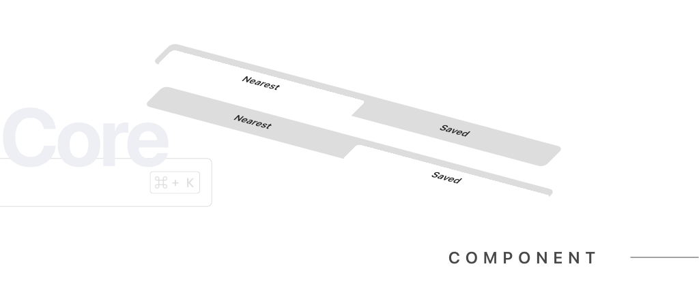

import { Steps } from '@astrojs/starlight/components';




The `TabListComponent` is a component used to switch between different tabs in your application.

## Features

The `TabListComponent` can take on multiple tabs based on the `labels` prop. The state determines the functionality of the tab list.

- Active Tab: The tab that is currently selected.
- Inactive Tabs: Tabs that are not currently selected.

---

### Usage


```html
<shared-tab-list
  [labels]="['Tab 1', 'Tab 2', 'Tab 3']"
  (currentTabEmitter)="onTabChange($event)" />
```

## Props 

The `TabListComponent` accepts the following props:

```ts
   /**
    * The `labels` property holds the labels for all tabs.
    */
   @Input() labels!: string[];

   /**
    * The `currentTabEmitter` event is emitted whenever the active tab is changed.
    */
   @Output() currentTabEmitter = new EventEmitter<number>();
```

## How to Import It

<Steps>

1. Import the component into your TypeScript file:

   ```ts
   import { TabListComponent } from "@atl-transit/shared";
   ```

2. Add your component into the import property of your component
    
   ```ts
   @Component({
     selector: "my-component",
     standalone: true,
     imports: [TabListComponent],
   })
   export class MyComponent {}
   ```

3. In your `component.ts` file, create a method to collect the value emitted from the tab list:

   ```ts
   export class MyComponent {
      activeTab: number = 0;

      onTabChange(tabIndex: number) {
         this.activeTab = tabIndex;
         // Now you can use this.activeTab in your component
      }
   }
   ```
   

4. Use the component in your template:

   ```html
     <shared-tab-list
    [labels]="['Tab 1', 'Tab 2', 'Tab 3']"
    (currentTabEmitter)="onTabChange($event)"
    class="tab-list"
    >
     </shared-tab-list>
   ```

5. Then, in your template, bind the `currentTabEmitter` output event to this method:

   ```html
   <shared-tab-list
      [labels]="['Tab 1', 'Tab 2', 'Tab 3']"
      (currentTabEmitter)="onTabChange($event)"
      class="tab-list"
   >
   </shared-tab-list>
   ```

</Steps>