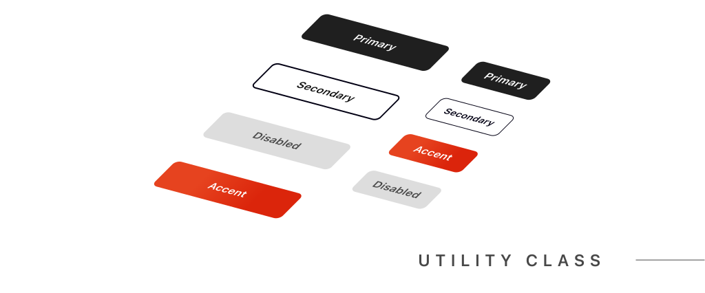
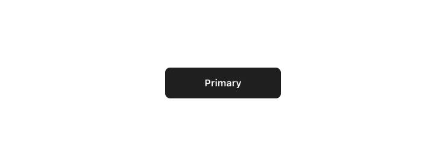
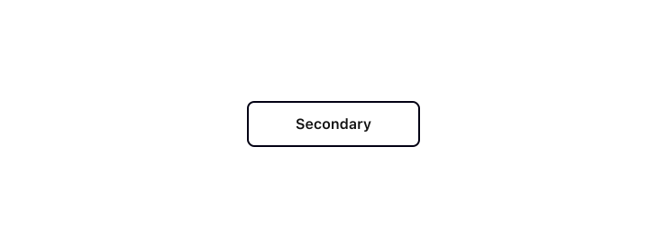
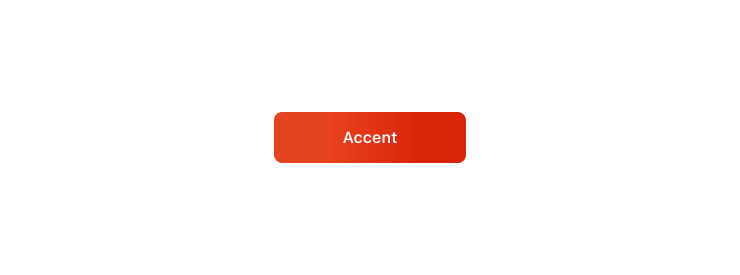
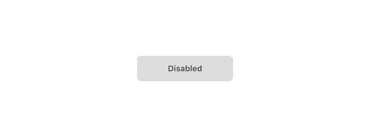
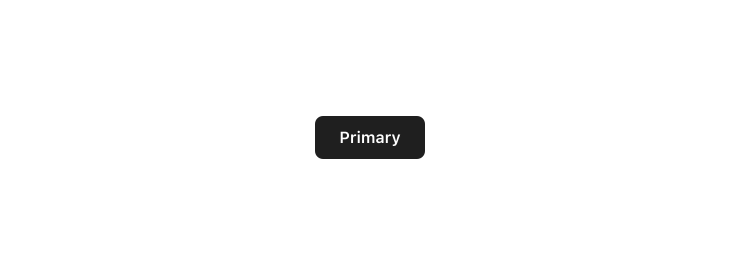
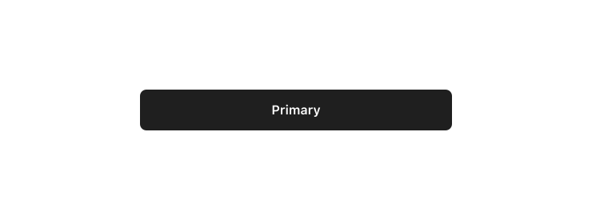
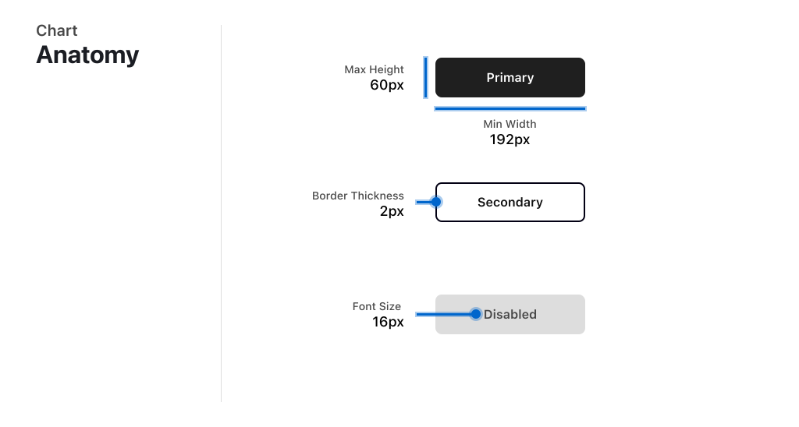

import { Aside } from '@astrojs/starlight/components';




A button in a UI is a clickable element that performs a specific task. This task could be submitting a form, changing pages, starting a download, or other actions. Buttons come in different styles and types for various uses.

## Appearance

### Primary Button



```html
<button class="btn btn-primary">Primary</button>
```

### Secondary Button



```html
<button class="btn btn-secondary">Secondary</button>
```


### Accent Button




```html
<button class="btn btn-accent">Accent</button>
```

### Disabled Button




```html
<button class="btn btn-disabled">Disabled</button>
```

# Size

<Aside>When screen size is below 640px, all buttons become full width</Aside>

### Large Button


```html
<button class="btn btn-primary">Large</button>
```

### Small Button



```html
<button class="btn btn-primary btn-small">Small</button>
```

### Fill Button



```html
<button class="btn btn-primary btn-fill">Fill</button>
```

# Anatomy Chart


