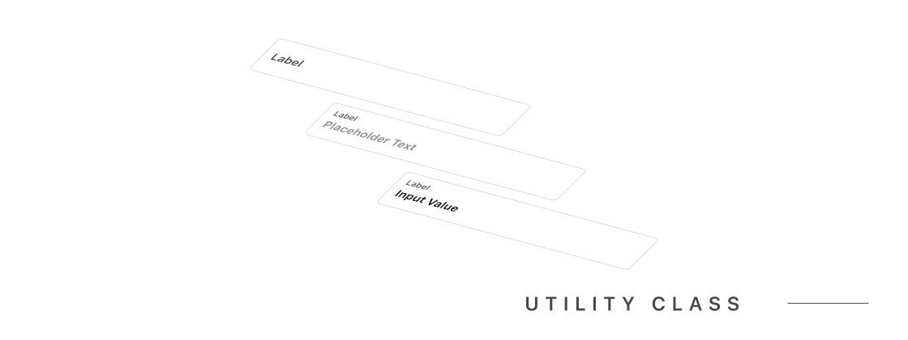
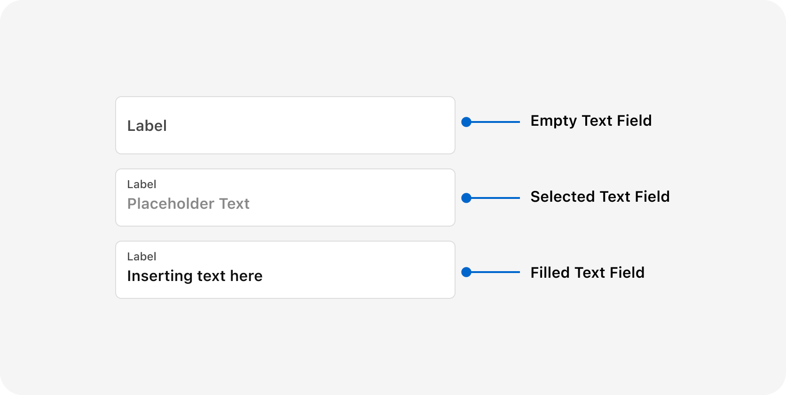

An input field in a UI is a field that allows users to enter text or data. Inputs come in different styles and types for various uses.

## Appearance



### Text Input

```html
<div class="input input-disabled relative">
    <input type="text" class="block" placeholder="Placeholder Text" />
    <label>Label</label>
</div>
```
