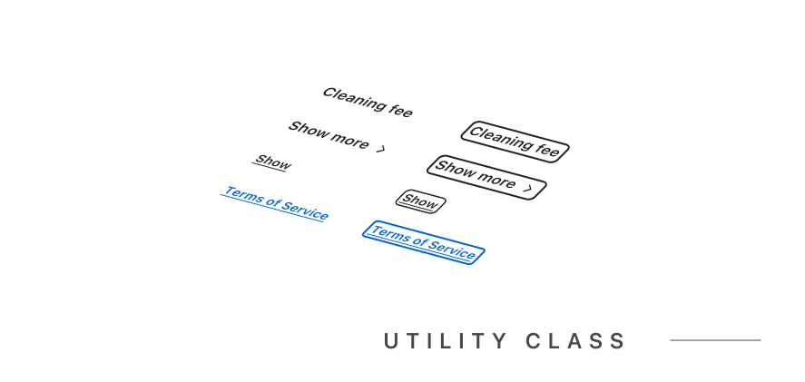

A link in a UI is a clickable element that navigates to another page or section of the current page. Links come in different styles and types for various uses.


## Appearance


### Primary Link

```html
<a href="#" class="link link-primary">Primary Link</a>
```


### Secondary Link


```html

<a href="#" class="link link-secondary">Secondary Link</a>
```